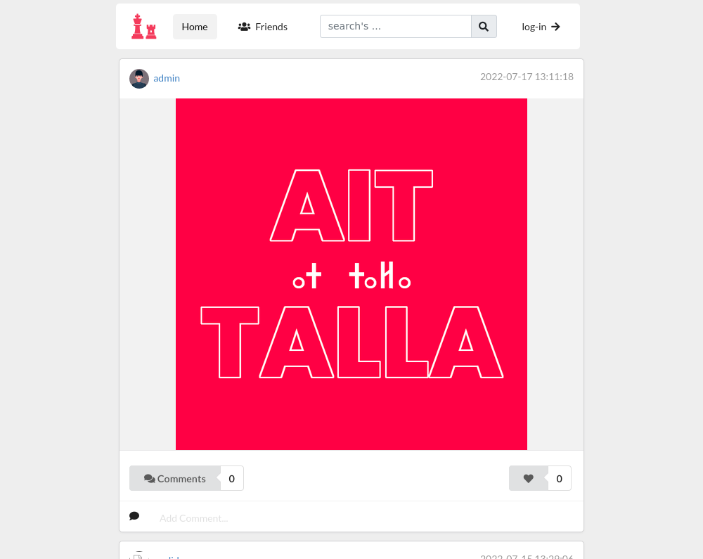
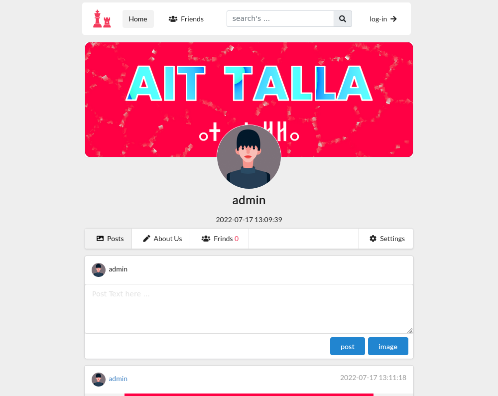
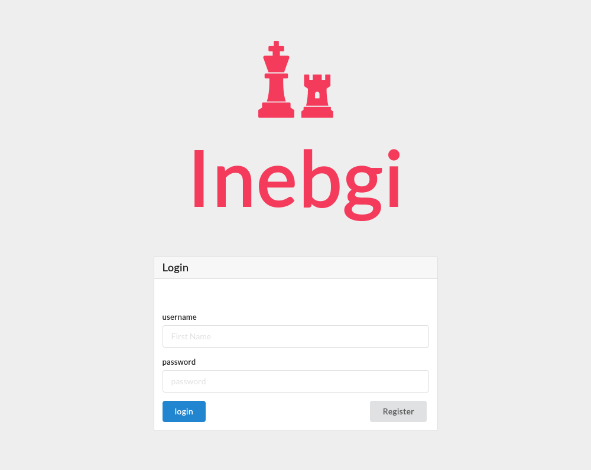

# inebgi - Réseau Social de Média

**inebgi** est une application web de réseau social de média développée en PHP avec MySQLi pour la gestion de la base de données, et Semantic UI pour le CSS.

## Fonctionnalités

- **Page de Connexion :** Permet aux utilisateurs de se connecter à leurs comptes.
- **Page d'Inscription :** Permet aux nouveaux utilisateurs de créer un compte.
- **Page de Profil :** Permet aux utilisateurs de voir et de modifier leur profil.
- **Publication de Texte et d'Images :** Permet aux utilisateurs de créer des posts contenant du texte et des images.

## Technologies Utilisées

- **PHP** - Langage côté serveur pour la logique applicative.
- **MySQLi** - Interface pour interagir avec la base de données MySQL.
- **Semantic UI** - Framework CSS pour une interface utilisateur moderne et responsive.

## Captures d'Écran

*Page d'accueil de l'application inebgi*

*Exemple de page de profil utilisateur*

*Exemple de page de Connexion*
## Installation

Pour installer et exécuter ce projet localement, suivez ces étapes :

1. Clonez ce repository : `git clone https://github.com/aitTalla/Inebgi-Reseau-Social-de-M-dia-Ait-Talla.git`
2. Importez la base de données depuis le fichier `inibgiDB_dump.sql`.
3. Configurez les informations de connexion à la base de données dans `config.php`.
4. Lancez un serveur PHP local : `php -S localhost:8000`
5. Ouvrez votre navigateur et accédez à `http://localhost:8000`

## Contribuer

Les contributions sont les bienvenues ! Pour des suggestions, des fonctionnalités supplémentaires ou des bugs, veuillez ouvrir une issue ou soumettre une pull request.

## Auteur

Ce projet a été développé par [Ait Talla](https://aittalla-corporation.web.app).

## Licence

Ce projet est sous licence MIT - voir le fichier `LICENSE` pour plus de détails.
